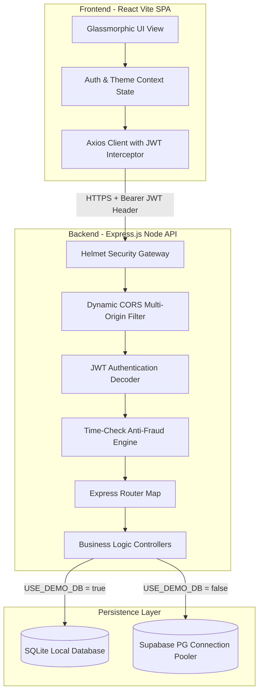

# 🗳️ CrowdPulse - Gamified Predictive Polls & Voting Platform

Welcome to **CrowdPulse** (BasicVotingSystem), an enterprise-grade, Web3-inspired gamified community polling and predictive voting platform. Designed with sleek neon glassmorphism, CrowdPulse allows users to voice opinions, participate in predictive forecasting, complete verification-backed community tasks for coin rewards, and climb dynamic local leaderboards.

This repository contains both the high-performance **Express.js API Backend** and the **React Vite SPA Frontend**.

---

## 🏗️ Technical Architecture & Flow

The system employs a decoupled, highly secure Client-Server architecture tailored for lightweight edge hosting (Vercel + Render) paired with a dual-stage database sync engine.



---

## 🌟 Key Feature Modules

### 1. 📊 Gamified Economy & Interactive Dashboard
*   **Daily Check-in Payout**: Claim a daily bonus of free virtual coins. The backend tracks your check-in history to maintain an active daily streak.
*   **Real-time Statistics Widgets**:
    *   **Win Rate**: Dynamically calculated percentage of your resolved predictions that matched the winning options.
    *   **Reputation Score**: Build credentials through voting, creating polls, and completing tasks.
    *   **Polls Created**: Dynamically counted polls you have published.
    *   **Total Earned**: Dynamic aggregation of all transactions (check-ins, voting, tasks).
*   **Dynamic Ledger Log**: Live transaction history showing exact coin sources and dynamic timestamp details.

### 2. 🗳️ Predictive Forecasting & Community Polls
*   **Predictive Poll Creation**: Category-mapped polls (Esports, Tech, YouTube, Sports) with custom options, closing times, and reward pools.
*   **Sequential Vote Guard**: Multi-row Sequelize transactions prevent race conditions, guaranteeing exactly one vote per user per poll.
*   **Reward Distribution Engine**: Once an Admin resolves a poll with its actual outcome, the backend automatically distributes proportional reward shares to all users who predicted correctly!

### 3. 🛡️ Verification-Backed Task Center
*   **Task List**: Custom campaigns where users can earn coins by viewing articles, verifying accounts, or completing surveys.
*   **Time-Check Anti-Fraud Security**: When a user starts a task, the backend records the initial timestamp. When verifying, the middleware checks the elapsed time against `minimumTimeRequirement`. **Automated script submissions and instant clickers are immediately blocked.**
*   **Category Splits**: Instantly filter tasks by Daily, Featured, Surveys, or Esports.

### 🤖 4. AI-Powered Poll Autogenerator (Admin Panel)
*   **One-Click AI Generation**: Admins can request Groq AI models to automatically draft and format complete, engaging, ready-to-publish polls with custom options and titles in a single click.

---

## 🗄️ Database Schema & Models

CrowdPulse leverages **Sequelize ORM** to coordinate migrations and queries across both SQL systems. Below is a map of the core database tables:

| Table Name | Primary Purpose | Key Fields |
| :--- | :--- | :--- |
| **`Users`** | Stores user identity, authentication hashes, and coin economy. | `id`, `name`, `email`, `coinBalance`, `reputationScore`, `level`, `lastCheckIn`, `checkInStreak` |
| **`Polls`** | Holds community questions and closing times. | `id`, `title`, `description`, `category_id`, `creator_id`, `status` (open, closed, resolved), `winningOptionId` |
| **`PollOptions`** | Interactive choices for each poll. | `id`, `poll_id`, `optionText`, `votesCount` |
| **`Votes`** | Records user predictions and choices. | `id`, `user_id`, `poll_id`, `option_id`, `votedAt` |
| **`Transactions`** | Financial ledger tracking coin history. | `id`, `user_id`, `amount`, `transactionType` (`check_in`, `task_reward`, `vote_reward`), `referenceId` |
| **`Tasks`** | Task requirements and reward details. | `id`, `title`, `description`, `rewardCoins`, `minimumTimeRequirement`, `taskLink` |
| **`UserTaskHistory`** | Tracks user task lifecycle status. | `id`, `user_id`, `task_id`, `status` (`started`, `completed`), `startedAt`, `completedAt` |

---

## 📡 Core API Gateway Reference

All endpoints are prefixed with `/api` and require a bearer JWT header (`Authorization: Bearer <token>`) except authentication endpoints.

### Authentication Module
*   `POST /auth/register` $\rightarrow$ Register standard email/password accounts.
*   `POST /auth/login` $\rightarrow$ Standard user login, returns JWT token.
*   `POST /auth/google` $\rightarrow$ Exchange a Google OAuth Credential token for a secure local JWT.

### Community Polls Module
*   `GET /polls` $\rightarrow$ Retrieve all active, closed, or resolved polls.
*   `GET /polls/:id` $\rightarrow$ Fetch detailed metrics, options, and live percentages for a specific poll.
*   `POST /polls` $\rightarrow$ Publish a new community poll (Voter & Admin).
*   `POST /polls/:id/vote` $\rightarrow$ Cast a prediction on a specific option.
*   `POST /polls/:id/resolve` (Admin) $\rightarrow$ Declare the final winning option and distribute coin pools.

### Task Verification Module
*   `GET /tasks` $\rightarrow$ Get all tasks and categories along with the active user's progress.
*   `POST /tasks/:id/start` $\rightarrow$ Record a starting timestamp for a task.
*   `POST /tasks/:id/verify` $\rightarrow$ Run anti-fraud time check, reward user coins, and log the transaction.

### Economy & Streaks Module
*   `GET /economy/balance` $\rightarrow$ Get dynamic user stats, check-in history, coin balance, and active streaks.
*   `POST /economy/check-in` $\rightarrow$ Verify and award daily check-in rewards.

---

## ⚙️ Detailed Environment Configuration

Set up these keys in a `.env` file inside `Backend/`:

```env
# ──────────────────────────────────────────────────────────────────────────────
# DATABASE CONFIGURATION
# ──────────────────────────────────────────────────────────────────────────────
USE_DEMO_DB=true                 # Set to 'true' for local SQLite, 'false' for production PostgreSQL

# Supabase Production PostgreSQL Credentials (Only needed if USE_DEMO_DB=false)
DB_HOST=aws-1-ap-southeast-2.pooler.supabase.com
DB_PORT=6543
DB_NAME=postgres
DB_USER=postgres.wdymrbdtschkzrjgdvlo
DB_PASSWORD=rSRoawxCiz12qqFp

# ──────────────────────────────────────────────────────────────────────────────
# SECURITY & AUTHENTICATION
# ──────────────────────────────────────────────────────────────────────────────
JWT_SECRET=high-level-secure-voting-secret
GOOGLE_CLIENT_ID=79151610115-r1fr7v2apoe8drbmdgksd3mmj43n68hs.apps.googleusercontent.com

# ──────────────────────────────────────────────────────────────────────────────
# INTEGRATIONS & APIS (OPTIONAL)
# ──────────────────────────────────────────────────────────────────────────────
GROQ_API_KEY=gsk_your_groq_ai_model_key_here
EMAIL_USER=meetvirugama4902@gmail.com
EMAIL_PASS=qixzhzuwdmhjclby

# ──────────────────────────────────────────────────────────────────────────────
# ROUTING & RUNTIME ENVIRONMENT
# ──────────────────────────────────────────────────────────────────────────────
FRONTEND_URL=http://localhost:5173
PORT=5001
NODE_ENV=development
```

---

## 🚀 Step-by-Step Installation Guides

### Option A: Frictionless Local Run (Recommended for Testing)

1.  **Clone the Repo**:
    ```bash
    git clone https://github.com/Meetvirugama/BasicVotingSystem.git
    cd BasicVotingSystem
    ```
2.  **Start and Seed the Backend**:
    ```bash
    cd Backend
    npm install
    
    # Run the database migration and populate categories/tasks
    node seed.js
    
    # Start the server locally
    npm start
    ```
    *The API server will run on [http://localhost:5001](http://localhost:5001).*
3.  **Launch the Frontend**:
    ```bash
    cd ../Frontend
    npm install
    
    # Run the Vite server
    npm run dev
    ```
    *Open [http://localhost:5173](http://localhost:5173) in your browser.*

---

### Option B: Cloud Production Deployment

#### 🖥️ Frontend (Vercel)
1. Link your repository to **Vercel**.
2. Select the **`Frontend`** directory as your root directory.
3. Configure the following **Environment Variables**:
   * `VITE_API_URL` $\rightarrow$ `https://your-backend-service.onrender.com/api`
   * `VITE_GOOGLE_CLIENT_ID` $\rightarrow$ `79151610115-r1fr7v2apoe8drbmdgksd3mmj43n68hs.apps.googleusercontent.com`
4. Deploy!

#### ⚙️ Backend (Render)
1. Add a new **Web Service** on **Render**, linking your repository.
2. Select **`Backend`** as the root directory.
3. Choose the **Node** environment.
4. Input your **Environment Variables** (matching the Supabase PostgreSQL connection details above):
   * `USE_DEMO_DB` $\rightarrow$ `false`
   * `DB_HOST` $\rightarrow$ `aws-1-ap-southeast-2.pooler.supabase.com`
   * `DB_PORT` $\rightarrow$ `6543`
   * `DB_NAME` $\rightarrow$ `postgres`
   * `DB_USER` $\rightarrow$ `postgres.wdymrbdtschkzrjgdvlo`
   * `DB_PASSWORD` $\rightarrow$ `rSRoawxCiz12qqFp`
   * `FRONTEND_URL` $\rightarrow$ `https://your-frontend-domain.vercel.app`
5. Click deploy!

---

## 🎨 Design & Custom CSS System

*   **SaaS Glassmorphism**: Cards feature deep translucent backgrounds, glowing high-contrast outline borders, and subtle layout transitions.
*   **Tailored CSS**: Completely hand-written custom CSS styling, avoiding massive framework bottlenecks for optimal performance.
*   **Fully Responsive**: Grid elements dynamically align, adapting layouts for all screen sizes from mobile devices to desktop displays.

---

## 👨‍💻 Engineering & Development Collaborators

*   **Meet Virugama** — Creator & Lead Full Stack Developer.
*   **Antigravity (Google DeepMind)** — Agentic AI Coding Assistant & Architect.
    *   *Antigravity* built the secure time-check verification engine, dynamic dashboard statistics system, robust multi-origin CORS handling, dynamic database port routing, database migration/seeding workflows, and resolved all Render/Vercel deployment hurdles to deliver this premium product.

---
⭐ **Show Your Support**: If you love this project, give it a star!
