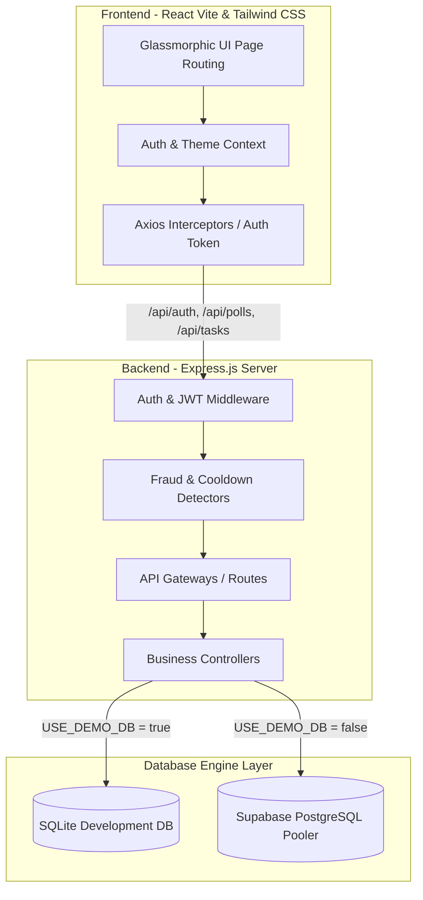

# 🗳️ CrowdPulse - Gamified Predictive Polls & Voting Platform

**CrowdPulse** (BasicVotingSystem) is a high-performance, web3-style gamified prediction and community polling platform. Users can create, predict, and vote on competitive polls, complete targeted social tasks in the Task Center to earn virtual coin rewards, build their reputation, climb the leaderboard, and unlock custom tiers. 

The entire system features a fully responsive, custom glassmorphic neon design system, role-based access controls, robust anti-fraud protection, and dual-mode database synchronization.

---

## 🏗️ Technical Architecture

The platform is engineered using a decoupled Client-Server architecture designed to run on light edge containers:



---

## 🌟 Core Modules & Features

### 🎮 Gamified Economy & Dashboard
*   **Daily Check-in Reward**: Claim free coins every 24 hours with an active daily streak calculator.
*   **Dynamic Quick Stats**: Real-time calculated dashboard widgets:
    *   **Win Rate**: The actual success rate of completed predictions.
    *   **Reputation**: Experience score earned through community participation.
    *   **Polls Created**: The real number of polls published by the active user.
    *   **Total Earned**: Dynamic transaction sum of all rewards.
*   **Transaction Logs**: Complete dynamic audit history of all coin accruals (check-ins, voting rewards, task payouts).

### 📝 Predictive Polls Engine
*   **Create Polls**: Craft custom multi-option polls across Tech, Esports, YouTube, and Sports.
*   **One-Vote Security**: Backend Sequelize transactions guarantee a single vote/prediction per user per poll.
*   **Predictive Rewards**: Resolve polls to distribute proportional coin shares to voters of the winning option!

### 🛡️ Secure Task Verification Center
*   **Task System**: Earn massive coin boosts by completing targeted social or community tasks.
*   **Anti-Fraud Guard**: Security middleware verifying minimum time requirements (checking local server timestamps against client completion durations) to block automated submissions.
*   **Category Filtering**: Quick filter tasks by Daily, Featured, Surveys, and Esports.

### 🤖 AI Poll Autogenerator (Admin-Only)
*   **Automated Poll Creation**: Admin dashboard leverage automated prompt models to construct and publish engaging, ready-to-vote polls in single click.

---

## 🗄️ Dual-Mode Storage Architecture

CrowdPulse features a dual-mode persistence layer, allowing frictionless offline local development and bulletproof production stability:

1.  **Lightweight Development (Local SQLite)**
    *   **Flag**: `USE_DEMO_DB=true`
    *   **Engine**: SQLite via a local `./database.sqlite` file.
    *   **Why**: Zero setup required. Allows starting the backend instantly offline.
2.  **Enterprise Durability (Production Supabase PostgreSQL)**
    *   **Flag**: `USE_DEMO_DB=false`
    *   **Engine**: Supabase PostgreSQL with Connection Pooling (over port `6543`).
    *   **Why**: Free Tier containers (like Render) have ephemeral disk storage which wipes SQLite on container rebuilds. Supabase PostgreSQL connection pooling guarantees your users, coins, votes, and streaks are **safely persisted forever**.

---

## 🔑 Environment Variables Setup

Create a `.env` file inside the `Backend/` folder:

```env
# Database Mode
USE_DEMO_DB=true   # Set to false in production to connect Supabase

# Supabase Production PostgreSQL Credentials (Only needed if USE_DEMO_DB=false)
DB_HOST=aws-1-ap-southeast-2.pooler.supabase.com
DB_PORT=6543
DB_NAME=postgres
DB_USER=postgres.wdymrbdtschkzrjgdvlo
DB_PASSWORD=your_supabase_password

# Authentication Secrets
JWT_SECRET=your_jwt_signing_secret_here
GOOGLE_CLIENT_ID=your_google_oauth_client_id.apps.googleusercontent.com

# External API Integrations (Optional)
GROQ_API_KEY=gsk_your_groq_ai_generator_key
EMAIL_USER=your_gmail_sender@gmail.com
EMAIL_PASS=your_gmail_app_password

# CORS Settings
FRONTEND_URL=http://localhost:5173
PORT=5001
NODE_ENV=development
```

---

## 🚀 Running Locally (Step-by-Step)

### Prerequisites
Make sure you have [Node.js](https://nodejs.org/) installed.

### Step 1: Clone the Repository
```bash
git clone https://github.com/Meetvirugama/BasicVotingSystem.git
cd BasicVotingSystem
```

### Step 2: Set Up and Run the Backend
```bash
cd Backend
npm install

# Run database migration and initial seed (creates tasks, categories, and test users)
node seed.js

# Start the local development server
npm start
```
*The backend will be live on [http://localhost:5001](http://localhost:5001).*

### Step 3: Set Up and Run the Frontend
```bash
cd ../Frontend
npm install

# Start the Vite development build
npm run dev
```
*The frontend will open on [http://localhost:5173](http://localhost:5173).*

---

## 🎨 Design System & CSS
*   **Pure Custom CSS**: Written without rigid component frameworks (no Tailwind or Bootstrap bottlenecks) for extreme design control.
*   **Glassmorphism**: Elegant transparent cards, glowing neon borders, subtle transitions, and hover-triggered micro-animations.
*   **Tailored Dark Mode**: Optimized color contrast, keeping text readable and layouts clean across all display sizes.

---

## 👨‍💻 Engineering Collaborators

*   **Meet Virugama** — Creator & Lead Full Stack Developer.
*   **Antigravity (Google DeepMind)** — Agentic AI Coding Assistant & Architect.
    *   *Antigravity* built the secure task verification engine, dynamic dashboard statistics system, robust multi-origin CORS handling, dynamic database port routing, database migration/seeding workflows, and resolved all Render/Vercel deployment hurdles to deliver this premium product.

---
⭐ **Show Your Support**: If you love this project, give it a star!
