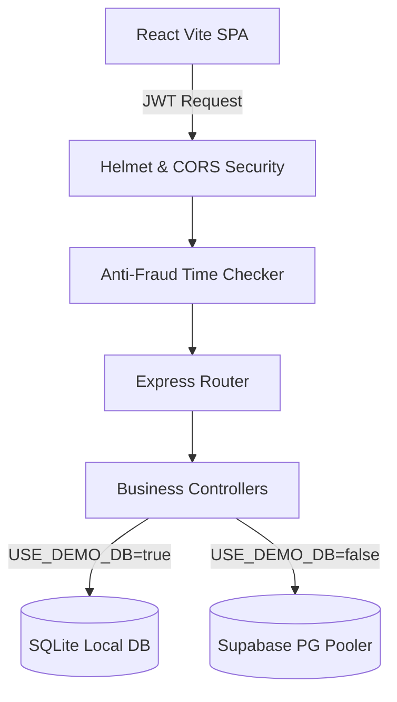

# 🗳️ CrowdPulse - Gamified Predictive Polls & Voting

> [!TIP]
> A high-performance, web3-style gamified prediction and community polling platform featuring a custom glassmorphic neon design, anti-fraud security, and a dual-mode database engine.

---

## 🏗️ System Architecture



---

## ⚡ Core Features At A Glance

### 🎮 Gamified Economy & Dashboard
*   **Daily Check-in**: Claim dynamic coin payouts with an active check-in streak tracker.
*   **Ledger Log**: Complete audit trails of check-ins, tasks completed, and predictions won.
*   **Real-Time Analytics Widgets**:
    *   `Win Rate` $\rightarrow$ Ratio of correct predictions to resolved polls.
    *   `Reputation` $\rightarrow$ Dynamic experience levels earned through activity.
    *   `Polls Created` $\rightarrow$ Real-time creator count.
    *   `Total Earned` $\rightarrow$ Aggregated lifetime earnings.

### 🗳️ Predictive Forecasting Engine
*   **Interactive Forecasts**: Cast votes on custom polls (Esports, Tech, YouTube, Sports).
*   **Proportional Rewards**: Winning voters automatically split the coin pool when a poll resolves.
*   **Double-Vote Protection**: Sequelize transactions guarantee a single prediction per user.

### 🛡️ Task Verification Center
*   **Activity Hub**: Complete surveys, view tutorials, or test tools for massive coin rewards.
*   **Time-Check Defense**: Middleware tracks exact starting and completion timestamps. **Automated bots and speed-clickers are instantly blocked.**
*   **Category Filter**: Quickly toggle between Daily, Featured, Surveys, and Esports campaigns.

### 🤖 Admin AI Autogen
*   **One-Click Polls**: Integrated Groq LLM generating complete multi-option category polls.

---

## 🗄️ Database Tables (Sequelize ORM)

| Table Name | Primary Purpose | Key Fields |
| :--- | :--- | :--- |
| **`Users`** | Balance, experience levels, and authentication. | `id`, `name`, `email`, `coinBalance`, `reputationScore`, `level`, `lastCheckIn`, `checkInStreak` |
| **`Polls`** | Holds community questions and closing times. | `id`, `title`, `description`, `category_id`, `creator_id`, `status` |
| **`PollOptions`**| Multiple choice alternatives for each poll. | `id`, `poll_id`, `optionText`, `votesCount` |
| **`Votes`** | Records user predictions. | `id`, `user_id`, `poll_id`, `option_id`, `votedAt` |
| **`Transactions`**| Historical audit trail of all coin transactions. | `id`, `user_id`, `amount`, `transactionType` |
| **`Tasks`** | Task parameters, links, and rewards. | `id`, `title`, `description`, `rewardCoins`, `minimumTimeRequirement` |
| **`UserTaskHistory`**| Tracks task lifecycle progress. | `id`, `user_id`, `task_id`, `status` (`started`, `completed`) |

---

## 📡 Essential API Gateways

| Endpoint | Method | Authentication Required | Description |
| :--- | :--- | :---: | :--- |
| `/auth/google` | `POST` | ❌ | Exchange Google Credentials for local secure JWT. |
| `/polls/:id/vote`| `POST` | ✅ | Cast a prediction on a specific option. |
| `/polls/:id/resolve`| `POST` | ✅ (Admin) | Resolve a poll and trigger coin rewards. |
| `/tasks/:id/start`| `POST` | ✅ | Trigger task start timestamp. |
| `/tasks/:id/verify`| `POST` | ✅ | Validate duration requirement and claim coins. |
| `/economy/check-in`| `POST` | ✅ | Claim daily reward and increment active streak. |

---

## ⚙️ Safe Environment Setup (`Backend/.env`)

```env
# Database Mode
USE_DEMO_DB=true  # Set 'true' for local SQLite, 'false' for production Supabase

# Supabase Production PostgreSQL Credentials (Only if USE_DEMO_DB=false)
DB_HOST=your-supabase-project.pooler.supabase.com
DB_PORT=6543
DB_NAME=postgres
DB_USER=postgres.your-project-id
DB_PASSWORD=your-supabase-password-here

# Authentication Secrets
JWT_SECRET=your-secure-jwt-secret-key-here
GOOGLE_CLIENT_ID=your-google-oauth-client-id.apps.googleusercontent.com

# Integrations & APIs (Optional)
GROQ_API_KEY=gsk_your_groq_ai_model_key_here
EMAIL_USER=your-email-address@gmail.com
EMAIL_PASS=your-email-app-password-here

# Routing Configurations
FRONTEND_URL=http://localhost:5173
PORT=5001
NODE_ENV=development
```

---

## 🚀 Instant Local Installation

```bash
# 1. Clone the repository
git clone https://github.com/Meetvirugama/BasicVotingSystem.git
cd BasicVotingSystem

# 2. Spin up and seed the Backend
cd Backend
npm install
node seed.js     # Automatically migrates tables and seeds categories/tasks
npm start

# 3. Spin up the Frontend (in a new terminal)
cd ../Frontend
npm install
npm run dev
```

---

## 🛡️ Production Security Checklist

*   [x] **Helmet Security Headers**: Defends against scripting injections and clickjacking.
*   [x] **Dynamic CORS Filtering**: Locks server accessibility strictly to authorized web domains.
*   [x] **JWT Token Verification**: Restricts protected route requests to authenticated users.
*   [x] **Sequelize Transaction Locks**: Prevents concurrency bugs when writing votes to SQL tables.

---

## 👨‍💻 Engineering Collaborators

*   **Meet Virugama** — Creator & Lead Full Stack Developer.
*   **Antigravity (Google DeepMind)** — Agentic AI Coding Assistant & Architect.
    *   *Antigravity* built the secure task verification engine, dynamic dashboard statistics system, robust multi-origin CORS handling, dynamic database port routing, database migration/seeding workflows, and resolved all Render/Vercel deployment hurdles to deliver this premium product.

---
⭐ **Show Your Support**: If you love this project, give it a star!
